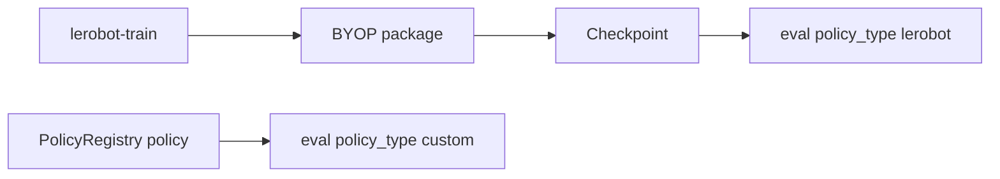

# LeHome + LeRobot custom policy development

## Constraints

- **LeRobot version**: The challenge pins `lerobot==0.4.3` in [`lehome_workspace/lehome-challenge/pyproject.toml`](lehome_workspace/lehome-challenge/pyproject.toml). The README badge may differ; trust `pyproject.toml`.
- **Ground truth**: Prefer paths under `lehome_workspace/lehome-challenge/` and official docs. For LeRobot internals not vendored in this repo, use tagged **v0.4.3** source or [HF BYOP docs](https://huggingface.co/docs/lerobot/bring_your_own_policies)—see [`reference.md`](reference.md).

## Two separate integration paths

| Path | When | Entry |
|------|------|--------|
| **A — LeRobot BYOP** | Train with `lerobot-train` and a checkpoint compatible with `LeRobotPolicy` | Installable package + YAML `policy.type` |
| **B — Eval-only custom** | Inference without using LeRobot’s `make_policy` in eval | `BasePolicy` + `PolicyRegistry` in this repo |



### Path A — Train a custom LeRobot policy (BYOP)

1. Follow the structure and registration described in [`docs/training.md` §3](lehome_workspace/lehome-challenge/docs/training.md) and the [Bring Your Own Policies](https://huggingface.co/docs/lerobot/bring_your_own_policies) guide.
2. **LeRobot v0.4.3 mechanics** (verify in [`reference.md`](reference.md)):
   - Register the config with `@PreTrainedConfig.register_subclass("your_policy_name")` (same pattern as `DiffusionConfig` in upstream `configuration_diffusion.py`).
   - Policy class name **`{Stem}Policy`** if config is **`{Stem}Config`**; modeling module path mirrors the config module (`configuration_*` → `modeling_*`).
   - Processor factory must be named `make_{your_policy_name}_pre_post_processors` in a `processor_*` module parallel to `configuration_*` (`configuration_*` → `processor_*`).
3. Train with a YAML config; set `policy.type` to your registered name (example pattern in [`docs/training.md`](lehome_workspace/lehome-challenge/docs/training.md)).
4. **LeHome dataset / features**: Use the feature tables and YAML patterns in [`docs/training.md` §2.4–2.5](lehome_workspace/lehome-challenge/docs/training.md) (`STATE` / `VISUAL` / `ACTION`, shapes, depth as `STATE`, `rename_map` for partial cameras).

**Baseline configs to copy**: [`configs/train_act.yaml`](lehome_workspace/lehome-challenge/configs/train_act.yaml), [`configs/train_dp.yaml`](lehome_workspace/lehome-challenge/configs/train_dp.yaml), [`configs/train_smolvla.yaml`](lehome_workspace/lehome-challenge/configs/train_smolvla.yaml).

### Path B — Custom policy for `scripts.eval` (numpy in / out)

1. Inherit [`BasePolicy`](lehome_workspace/lehome-challenge/scripts/eval_policy/base_policy.py) and implement `select_action(self, observation: Dict[str, np.ndarray]) -> np.ndarray` (and `reset()` if stateful).
2. Register with `@PolicyRegistry.register("your_name")` — see [`registry.py`](lehome_workspace/lehome-challenge/scripts/eval_policy/registry.py).
3. Import your module from [`scripts/eval_policy/__init__.py`](lehome_workspace/lehome-challenge/scripts/eval_policy/__init__.py) so registration runs at import time (same pattern as [`example_participant_policy.py`](lehome_workspace/lehome-challenge/scripts/eval_policy/example_participant_policy.py)).
4. **CLI wiring**: In [`scripts/utils/evaluation.py`](lehome_workspace/lehome-challenge/scripts/utils/evaluation.py), non-`lerobot` types receive `model_path=args.policy_path` when `--policy_path` is set; `lerobot` requires both `policy_path` and `dataset_root`.

**Observation / action contract** (eval): See [`docs/policy_eval.md`](lehome_workspace/lehome-challenge/docs/policy_eval.md) and the docstrings in [`base_policy.py`](lehome_workspace/lehome-challenge/scripts/eval_policy/base_policy.py).

### Path A eval — Loading a trained LeRobot checkpoint

The adapter used in eval is [`LeRobotPolicy`](lehome_workspace/lehome-challenge/scripts/eval_policy/lerobot_policy.py): it loads `PreTrainedConfig.from_pretrained`, builds `make_policy` / `make_pre_post_processors`, filters metadata and observations, runs `policy.select_action`, then postprocesses. When helping participants debug inference, trace this file first.

## Templates (minimal skeletons)

Literal shapes below mirror [`docs/training.md` §3 Quick Reference](lehome_workspace/lehome-challenge/docs/training.md) and v0.4.3 factory rules in [`reference.md`](reference.md). Replace stem `Acme` / string `acme` with your policy; keep **one** registered `policy.type` string, one `*Config` / `*Policy` pair, and `make_{type}_pre_post_processors` in the parallel `processor_*` module.

### Path A — BYOP package layout

```text
lerobot_policy_acme/
├── pyproject.toml
└── src/lerobot_policy_acme/
    ├── __init__.py
    ├── configuration_acme.py
    ├── modeling_acme.py
    └── processor_acme.py
```

`configuration_acme.py` (registration + config dataclass; compare upstream [`configuration_diffusion.py` on v0.4.3](https://raw.githubusercontent.com/huggingface/lerobot/v0.4.3/src/lerobot/policies/diffusion/configuration_diffusion.py)):

```python
from dataclasses import dataclass
from lerobot.configs.policies import PreTrainedConfig


@PreTrainedConfig.register_subclass("acme")  # must equal YAML policy.type
@dataclass
class AcmeConfig(PreTrainedConfig):
    # Policy fields + feature shapes: follow HF BYOP + training.md §2
    pass
```

`modeling_acme.py`: policy class **`AcmePolicy`** (factory pairs `AcmeConfig` → `AcmePolicy` per [`reference.md`](reference.md)). `processor_acme.py`: define **`make_acme_pre_post_processors`** (name uses the registered `policy.type` string, e.g. `acme`, not an arbitrary class-name stem).

YAML:

```yaml
policy:
  type: acme
  # input_features / output_features — see Path A step 4 above
```

### Path B — Eval adapter + registration

New module under [`scripts/eval_policy/`](lehome_workspace/lehome-challenge/scripts/eval_policy/) (pattern from [`example_participant_policy.py`](lehome_workspace/lehome-challenge/scripts/eval_policy/example_participant_policy.py)):

```python
import numpy as np
from typing import Dict

from .base_policy import BasePolicy
from .registry import PolicyRegistry


@PolicyRegistry.register("my_policy")
class MyPolicy(BasePolicy):
    def __init__(self, model_path=None, **kwargs):
        super().__init__(**kwargs)
        # Load weights / build runtime objects (optional model_path — see example_participant_policy)

    def select_action(self, observation: Dict[str, np.ndarray]) -> np.ndarray:
        pass  # Return float32 action vector matching env contract (docs/policy_eval.md)
```

Side-effect import so the decorator runs (same as [`__init__.py`](lehome_workspace/lehome-challenge/scripts/eval_policy/__init__.py) importing `CustomPolicy`):

```python
from .my_policy import MyPolicy  # noqa: F401
```

## Challenge-specific reminders

- **Garment labels**: Evaluation may randomize garment categories without exposing labels in sim—see [`README.md` “Important Reminder”](lehome_workspace/lehome-challenge/README.md).
- **Joint space preferred**: [`docs/training.md`](lehome_workspace/lehome-challenge/docs/training.md) discourages `observation.ee_pose` / `action.ee_pose` for SO101 IK reasons.
- **Commands**: Training quick start and eval examples—[`README.md` §3–4](lehome_workspace/lehome-challenge/README.md).

## Checklist before suggesting code

- [ ] Cited a concrete path in `lehome_workspace/lehome-challenge/` or an official URL for every API claim.
- [ ] Stated which path (A BYOP vs B eval adapter) the user is on.
- [ ] If extending LeRobot: noted v0.4.3 and pointed to [`reference.md`](reference.md) for upstream line-level verification.

## Additional resources

- [reference.md](reference.md) — v0.4.3 upstream URLs and factory behavior notes.
- [Artifacts/Vision-Backbone/vision-backbone-research.md](Artifacts/Vision-Backbone/vision-backbone-research.md) — project note on DP vision backbones vs BYOP.
