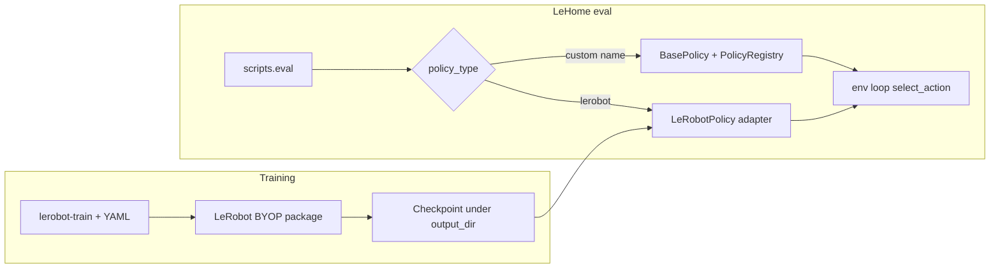

# LeHome + LeRobot custom policy skill — research record

## Status

Initial **search and context gather** is complete. No skill files have been written yet; when you are ready, the implementation step will add something like [`.cursor/skills/lehome-custom-policy/SKILL.md`](.cursor/skills/lehome-custom-policy/SKILL.md) (path TBD) following the [create-skill](file:///home/nidhinninan/.cursor/skills-cursor/create-skill/SKILL.md) structure.

## Two distinct “custom policy” paths (both official in this repo)

1. **Train with a custom LeRobot policy (BYOP)** — Documented in [lehome_workspace/lehome-challenge/docs/training.md](lehome_workspace/lehome-challenge/docs/training.md) §3; points to [Bring Your Own Policies](https://huggingface.co/docs/lerobot/bring_your_own_policies). Config pattern: `policy.type: my_custom_policy` plus `input_features` / `output_features` (same YAML schema as baselines).

2. **Evaluate without using the LeRobot stack in eval** — [lehome_workspace/lehome-challenge/docs/policy_eval.md](lehome_workspace/lehome-challenge/docs/policy_eval.md): inherit [`BasePolicy`](lehome_workspace/lehome-challenge/scripts/eval_policy/base_policy.py), register with [`PolicyRegistry`](lehome_workspace/lehome-challenge/scripts/eval_policy/registry.py), import in [`scripts/eval_policy/__init__.py`](lehome_workspace/lehome-challenge/scripts/eval_policy/__init__.py). CLI: `--policy_type custom` (or your registered name); `--policy_path` passed as `model_path` when set ([evaluation.py](lehome_workspace/lehome-challenge/scripts/utils/evaluation.py) ~294–296).

**Training-time LeRobot adapter (for `--policy_type lerobot`)** — Reference implementation: [`scripts/eval_policy/lerobot_policy.py`](lehome_workspace/lehome-challenge/scripts/eval_policy/lerobot_policy.py) (`PreTrainedConfig.from_pretrained`, `make_policy`, `make_pre_post_processors`, `LeRobotDatasetMetadata`, observation filtering, preprocessor transition with `TransitionKey`).

## Grounded sources to cite in the skill (no invented APIs)

| Source | Use in skill |
|--------|----------------|
| [README.md](lehome_workspace/lehome-challenge/README.md) | Quick start, `lerobot-train` configs, eval CLI table, garment-label warning |
| [docs/training.md](lehome_workspace/lehome-challenge/docs/training.md) | Feature shapes/types, `rename_map` for partial cameras, BYOP package layout excerpt, YAML template |
| [docs/policy_eval.md](lehome_workspace/lehome-challenge/docs/policy_eval.md) | Custom eval steps, observation key examples, image tensor snippet |
| [pyproject.toml](lehome_workspace/lehome-challenge/pyproject.toml) | **`lerobot==0.4.3`** (authoritative pin; README badge shows 0.4.2 — treat pyproject as truth) |
| [configs/train_*.yaml](lehome_workspace/lehome-challenge/configs/) | Real baseline configs (e.g. DP crop notes in `train_dp.yaml`) |
| [scripts/eval_policy/*](lehome_workspace/lehome-challenge/scripts/eval_policy/) | Contracts: `BasePolicy`, registry, `LeRobotPolicy`, `example_participant_policy.py` |
| [scripts/utils/evaluation.py](lehome_workspace/lehome-challenge/scripts/utils/evaluation.py) | How `policy_type` maps to constructor kwargs |
| [DeepWiki huggingface/lerobot](https://deepwiki.com/huggingface/lerobot) | Deeper BYOP / factory / `PreTrainedConfig.register_subclass` narrative; **cross-check** against 0.4.3 source or HF docs because wiki may track `main` |
| [HF docs: bring_your_own_policies](https://huggingface.co/docs/lerobot/bring_your_own_policies) | Official BYOP procedure |
| [Artifacts/Vision-Backbone/vision-backbone-research.md](Artifacts/Vision-Backbone/vision-backbone-research.md) | Project-internal note: DP + ViT/CLIP/DINO may need BYOP (already scoped for the hackathon workspace) |

## DeepWiki snapshot (for later skill text)

- BYOP layout: `lerobot_policy_<name>/` with `configuration_*.py`, `modeling_*.py`, `processor_*.py`; config uses `@PreTrainedConfig.register_subclass("<policy_name>")`; built-in examples cited: `pi0`, `pi05`, `diffusion` under `src/lerobot/policies/...` (verify line-level API against the version you run).

## HF MCP (optional when authoring)

When implementing the skill, use Hugging Face MCP to confirm **hub datasets / model cards** or doc-linked behavior; schema must be read from the MCP descriptor before calls (per workspace rules).

## Skill design constraints (when you say “build it”)

- **Third-person description** with triggers: LeHome, hackathon, `lerobot-train`, BYOP, `PolicyRegistry`, `BasePolicy`, `policy_type`, imitation learning.
- **Every code path**: quote or point to a specific file path in `lehome-challenge` or official docs; flag anything that depends on LeRobot version and instruct to verify in installed `lerobot==0.4.3`.
- **Brainstorming skill**: Run [`.cursor/skills/brainstorming/SKILL.md`](.cursor/skills/brainstorming/SKILL.md) before drafting creative sections (workflows, examples) in Agent mode when execution is allowed.

## Next step (your go-ahead)

When you instruct to proceed, create the project skill directory + `SKILL.md` that merges: (1) LeHome training + eval workflows above, (2) traceable snippets only, (3) explicit “verify in 0.4.3” for any LeRobot internals not copied from this repo.
