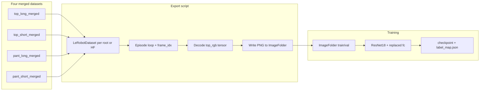

# Plan: Train 4-way garment visual classifier (ResNet18)

In-repo plan (including **VM-only execution steps**). Same folder as other workspace plans (e.g. `lehome_custom_policy_skill_8225a802.plan.md`).

## Context and constraints

- **Data source (canonical):** Hugging Face `lehome/dataset_challenge_merged` and/or the four local merged roots described in [Artifacts/Dataset-Viz_analysis/dataset_details.md](../../Artifacts/Dataset-Viz_analysis/dataset_details.md) (`top_long_merged`, `top_short_merged`, `pant_long_merged`, `pant_short_merged`), ~250 episodes each, **1000 episodes total**.
- **Camera for classification:** Use **`observation.images.top_rgb`** in LeRobot datasets. The export script also accepts aliases (`observation.images.top`, etc.) if present. Eval observations use `observation.images.top_rgb` in the sim; the router tries `top_rgb` then `top`-style keys ([`classifier_router_policy.py`](../../lehome_workspace/lehome-challenge/scripts/eval_policy/classifier_router_policy.py)).
- **Frame index:** Default **`frame_idx = 0`** on the export script; change to `1`, `2`, … **before** exporting/training on the VM if empirical checks show a later frame is clearer.
- **LeRobot indexing:** Global frame index = `dataset_from_index + frame_idx` per episode row in v3 metadata (`length`, `dataset_from_index`, `dataset_to_index`). If your `lerobot` version differs, confirm keys in `dataset.meta.episodes[0]` once in a Python shell.

## Architecture (data flow)



## Implementation status (in this repo)

| Item | Location |
|------|----------|
| Export LeRobot → ImageFolder | [`scripts/garment_classifier/export_garment_classifier_dataset.py`](../../scripts/garment_classifier/export_garment_classifier_dataset.py) |
| Train ResNet18 | [`scripts/garment_classifier/train_garment_classifier.py`](../../scripts/garment_classifier/train_garment_classifier.py) |
| Example router JSON | [`scripts/garment_classifier/example_router_config.json`](../../scripts/garment_classifier/example_router_config.json) |
| Eval router policy | [`lehome_workspace/lehome-challenge/scripts/eval_policy/classifier_router_policy.py`](../../lehome_workspace/lehome-challenge/scripts/eval_policy/classifier_router_policy.py) |
| Registry import | [`lehome_workspace/lehome-challenge/scripts/eval_policy/__init__.py`](../../lehome_workspace/lehome-challenge/scripts/eval_policy/__init__.py) |
| Eval wiring (`policy_type`) | [`lehome_workspace/lehome-challenge/scripts/utils/evaluation.py`](../../lehome_workspace/lehome-challenge/scripts/utils/evaluation.py) |

**Do not run export/training on the coding-only laptop** if `lerobot` / GPU / datasets are unavailable; run the steps below on the VM where LeHome + data live.

---

## VM execution checklist (exact steps)

Assume: repository root = `$LEHOME_TRIAL` (this project), Python env has **`lerobot`**, **`torch`**, **`torchvision`**, **`pillow`**, and LeHome challenge deps for eval.

### 0. Optional dataset sanity (recommended)

From the [lerobot-dataset-manager skill](../skills/lerobot-dataset-manager/SKILL.md):

```bash
lerobot-edit-dataset \
  --repo_id top_long_merged \
  --root /path/to/top_long_merged \
  --operation.type info \
  --operation.show_features true
```

Replace `--root` with your real merged dataset path. Confirm `observation.images.top_rgb` exists and episode counts look right.

For visual inspection (run in your own terminal; opens a UI):

```bash
lerobot-dataset-viz --repo-id top_long_merged --episode-index 0
# If local-only, pass the same --root pattern your lerobot CLI supports for local datasets.
```

### 1. Export one frame per episode (ImageFolder layout)

From `$LEHOME_TRIAL`:

```bash
cd "$LEHOME_TRIAL"

python scripts/garment_classifier/export_garment_classifier_dataset.py \
  --output_dir ./garment_classifier_data \
  --frame_idx 0 \
  --val_ratio 0.1 \
  --seed 42 \
  --top_long_repo top_long_merged \
  --top_long_root /path/to/top_long_merged \
  --top_short_repo top_short_merged \
  --top_short_root /path/to/top_short_merged \
  --pant_long_repo pant_long_merged \
  --pant_long_root /path/to/pant_long_merged \
  --pant_short_repo pant_short_merged \
  --pant_short_root /path/to/pant_short_merged
```

**Notes:**

- Each `--*_repo` string is the `repo_id` passed to `LeRobotDataset(repo_id, root=...)` (can match folder names, as in [datasets.md merge example](../../lehome_workspace/lehome-challenge/docs/datasets.md)).
- To debug quickly: add `--max_episodes 20` (caps episodes **per class**).
- To train on frame 1 instead of 0: re-run with `--frame_idx 1` and use a **fresh** `--output_dir` (or delete the old tree) before training.
- Artifacts: `garment_classifier_data/train/{class}/`, `garment_classifier_data/val/{class}/`, `export_summary.json`, `label_map.json`.

**ImageFolder class index order:** `torchvision.datasets.ImageFolder` sorts class folders **alphabetically** (`pant_long`, `pant_short`, `top_long`, `top_short`). The **training script writes the authoritative `label_map.json` and `class_names` into the checkpoint** from that order. Use checkpoint metadata when wiring experts, not the export’s helper `label_map.json`, if they ever disagree.

### 2. Train the classifier (GPU VM)

```bash
cd "$LEHOME_TRIAL"

python scripts/garment_classifier/train_garment_classifier.py \
  --data_dir ./garment_classifier_data \
  --output_dir ./garment_classifier_runs/run1 \
  --batch_size 32 \
  --num_workers 4 \
  --epochs 25 \
  --head_epochs 5 \
  --lr_head 1e-2 \
  --lr_full 1e-4 \
  --weight_decay 1e-4 \
  --seed 42
```

**Outputs:**

- `./garment_classifier_runs/run1/classifier_best.pt` — includes `model_state_dict`, `class_names`, `label_map`, `num_classes`.
- `./garment_classifier_runs/run1/label_map.json` — matches training (ImageFolder order).

Tune `--epochs`, `--batch_size`, and learning rates if validation accuracy plateaus or overfits.

### 3. Verification on VM

1. Read stdout **validation accuracy** and **4×4 confusion matrix** from the training script.
2. If frame `0` is suspect, re-export with `--frame_idx 1` (small `--max_episodes` smoke test first), re-train, and compare confusion matrices.
3. Optional: hold out an entire merged dataset as OOD test (not implemented in scripts; manual split if needed).

### 4. Run hackathon eval with the router

Copy [`scripts/garment_classifier/example_router_config.json`](../../scripts/garment_classifier/example_router_config.json) to a real path, e.g. `./router_config.json`, and edit:

- `dataset_root`: any LeRobot dataset root whose **metadata matches** what your four DP checkpoints expect (same feature schema as training).
- `task_description`: same string you use for DP eval (e.g. `fold the garment on the table`).
- `classifier_checkpoint`: path to `classifier_best.pt` from step 2.
- `expert_checkpoints`: four keys **`top_long`**, **`top_short`**, **`pant_long`**, **`pant_short`** — each value is a **LeRobot pretrained policy directory** (same as `--policy_path` for a single `lerobot` policy).

Eval driver (from `lehome-challenge` with Isaac / app launcher configured as you already do for `lerobot`):

```bash
cd "$LEHOME_TRIAL/lehome_workspace/lehome-challenge"

# Example only — align with your existing eval flags (task, garment list, etc.)
python -m scripts.eval \
  --policy_type classifier_router \
  --policy_path /absolute/path/to/router_config.json \
  ...other eval args you normally pass...
```

When `policy_type` is `classifier_router`, **`--policy_path` must be the router JSON**, not a single DP checkpoint. `dataset_root` inside the JSON supplies metadata for **all** experts. See [`scripts/utils/evaluation.py`](../../lehome_workspace/lehome-challenge/scripts/utils/evaluation.py).

---

## Risks and mitigations

| Risk | Mitigation |
|------|------------|
| Episode shorter than `frame_idx` | Export script skips; check `export_summary.json` → `skipped_short_episode`. |
| Video decode / IO bottleneck | Lower parallelism; export on machine with local SSD. |
| Train/eval image key mismatch | Router resolves `top_rgb` / `top`; keep preprocessing (resize 256, crop 224, ImageNet norm) identical to training val transforms. |
| LeRobot metadata field rename | Inspect one episode dict in VM once; adjust export script if needed. |

## References

- [Artifacts/Dataset-Viz_analysis/dataset_details.md](../../Artifacts/Dataset-Viz_analysis/dataset_details.md)
- [lehome_workspace/lehome-challenge/docs/datasets.md](../../lehome_workspace/lehome-challenge/docs/datasets.md)
- [`.cursor/skills/lerobot-dataset-manager/SKILL.md`](../skills/lerobot-dataset-manager/SKILL.md)
- DeepWiki / `huggingface/lerobot` — episode `dataset_from_index` + `length` for global indices.
